# CSS Selectors Explained

### * (Universal Selector) selects all the elements 
```css
    *{
        background-color:blue;


    }
```
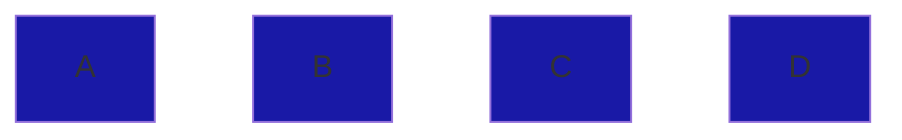

***

### div (Type selector) selects all elements of the same type
```css
    div{
        background-color:blue;


    }
```
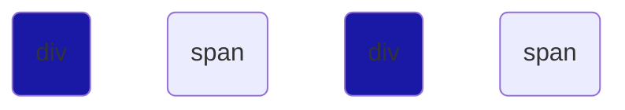

***

### .class-name (class selector) selects all elements having the same class attribute
```css
    .box{
        background-color:blue;


    }

```


***

### #unique-id (ID selector) selects element having the same id attribute 
```css
    #A{
        background-color:blue;


    }
```
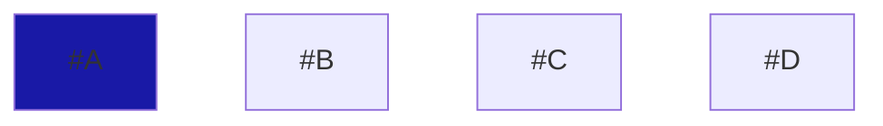

***

# Combinations

#### CSS selectors can be used in various combination to select desired element/s

### div p (Descendant slector) slelects all descendant(p) element of the parent(div)

```css
    div p{
        background-color:blue;


    }
```
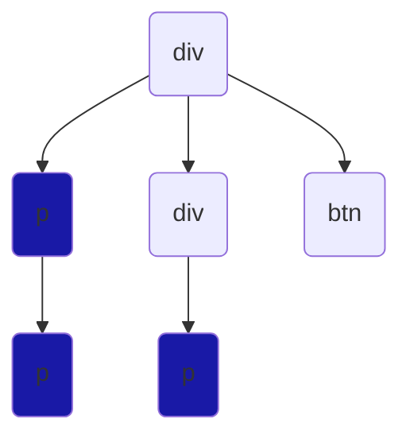

***

### div > p (Direct child selector) selects the 1st generation descendants

```css
    div > p{
        background-color:blue;


    }
```
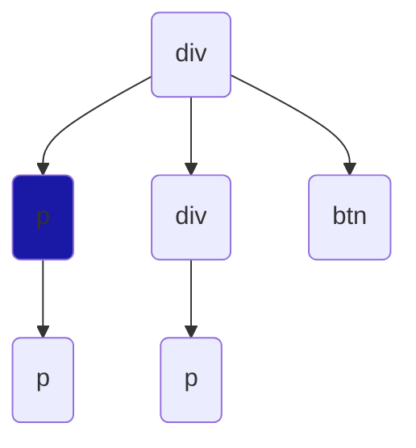

***

### div ~ p (General sibling slector) slects elements (p) next to (div) of same generation

```css
    div ~ p{
        background-color:blue;
        
        
    }
```
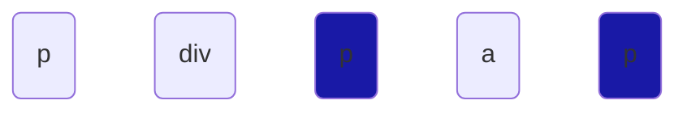

***

### div + p (adjacent sibling selector) selects element (p) immediate next to (div) element

```css
    div + p{
        background-color:blue;


    }
```
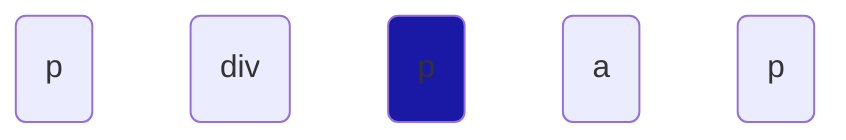

***

### a, div (Or slector) selects all elements in the list

```css
    a, div{
        background-color:blue;


    }
```
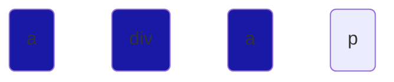

***

### a.class-name (And selctor) selects the matching combination
```html
<html>
    <style>
        a.a-color{
            color:red;
        }
        

    </style>

    <!-- Display in red -->
    <a class="a-color" href="">I'm Gokul</a> 
    <!-- No change -->
    <p class="p-color">I'm Gokul
</html>
```


***

# Pseudo Class 

### p:first-child (First child selector) selects the element if it's the first child

```css
    p:first-child{
        background-color:blue;


    }
```
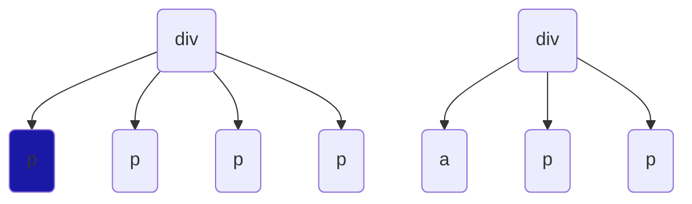

***

### p:last-child (Last child selector) selects the element if it's the last child

```css
    p:last-child{
        background-color:blue;


    }
```
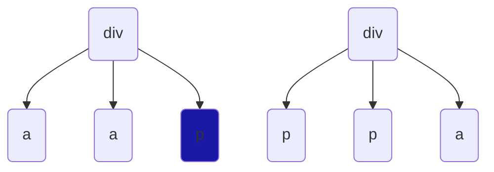
***

### a:only-child (Only child selector) selects element if it's a single child

```css
    a:only-child{
        background-color:blue;


    }
```
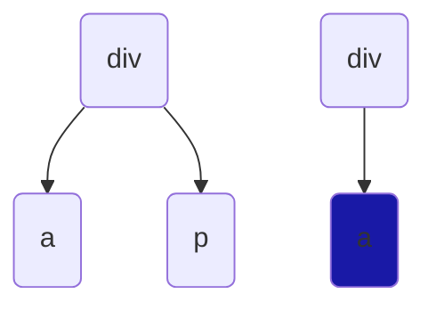

***

### a:first-of-type (First of type selector) selects first child of specified type

```css
    a:first-of-type{
        background-color:blue;


    }
```
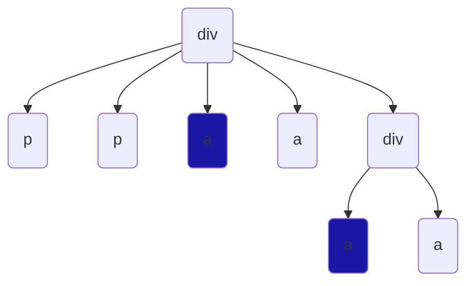

***

### a:last-of-type (Last of type selector) selects last child of specified type

```css
    a:last-of-type{
        background-color:blue;


    }
```
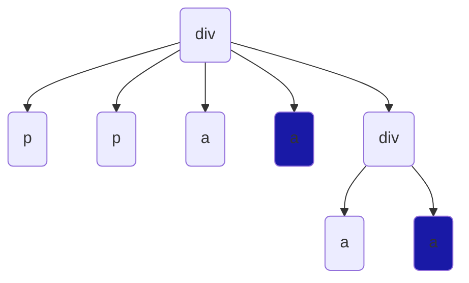
***

### p:only-of-type (Only of type) selects element if It's the unique among siblings

```css
    p:only-of-type{
        background-color:blue;


    }
```
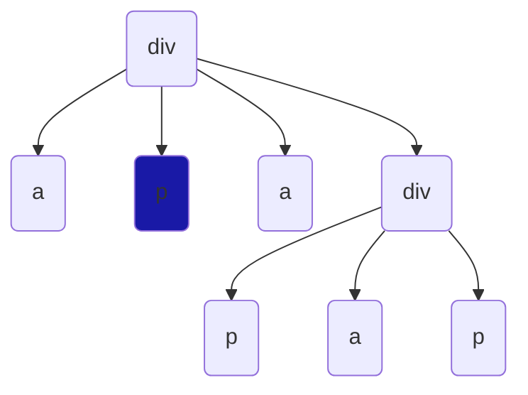

***

### a:not(.class1) - (Not selector) selects all elements (a) that's not specified inside the not selector

```css
    a:not(.class1){
        background-color:blue;

    }
```
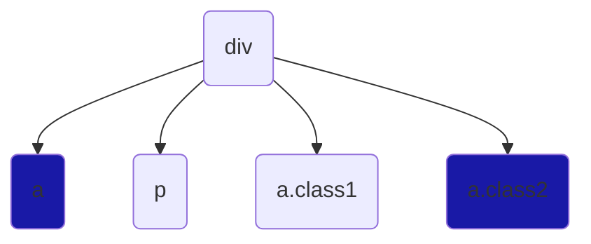

>Thanks. I hope it helps :) any queries do pm [@linkeshvaranr](https://twitter.com/messages/944879661900742657-1555128594728333313)
