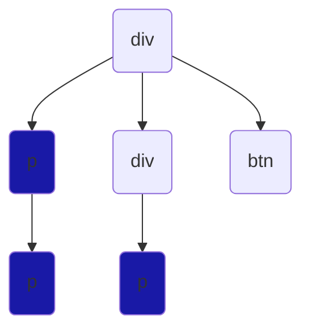
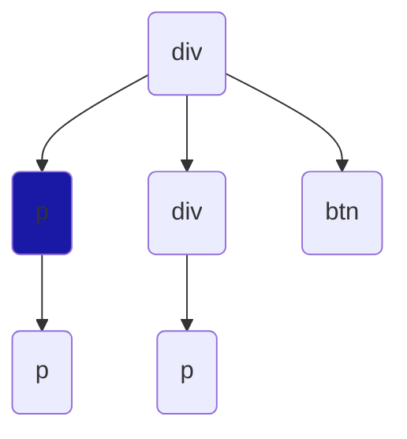

# CSS Selectors Explained

### * (Universal Selector) selects all the elements 
```css
    *{
        background-color:blue;


    }
```


***

### div (Type selector) selects all elements of the same type
```css
    div{
        background-color:blue;


    }
```


***

### .class-name (class selector) selects all elements having the same class attribute
```css
    .box{
        background-color:blue;


    }

```


***

### #unique-id (ID selector) selects element having the same id attribute 
```css
    #A{
        background-color:blue;


    }
```


***

# Combinations

#### CSS selectors can be used in various combination to select desired element/s

### div p (Descendant slector) slelects all descendant(p) element of the parent(div)

```css
    div p{
        background-color:blue;


    }
```


***

### div > p (Direct child selector) selects the 1st generation descendants

```css
    div > p{
        background-color:blue;


    }
```


***

### div ~ p (General sibling slector) slects elements (p) next to (div) of same generation

```css
    div ~ p{
        background-color:blue;
        
        
    }
```
```mermaid
    graph TD
    A(p) 
    B(div)
    C(p):::select
    D(a):::select
    E(p)


    classDef select fill:#1919a6;
}


