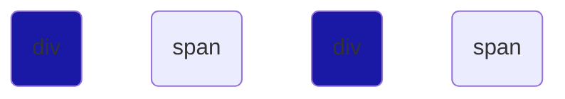

# CSS Cheat Sheet

### * (Universal Selector) selects all the element 
```css
    *{
        background-color:blue;


    }
```


***

### div (Type selector) selects elements of the same type
```css
    div{
        background-color:blue;

    }
```
