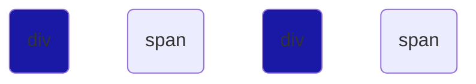
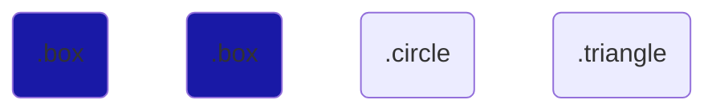

# CSS Selectors Explained

### * (Universal Selector) selects all the elements 
```css
    *{
        background-color:blue;


    }
```


***

### div (Type selector) selects all elements of the same type
```css
    div{
        background-color:blue;

    }
```


***

### .class-name (class selector) selects all elements having the same class attribute
```css
    .box{

    }

```



